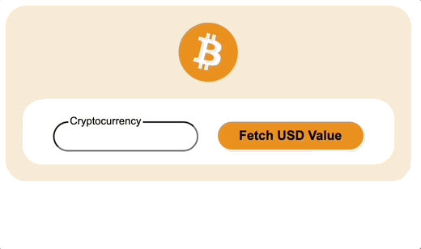

# crypto-web-component
This is a custom web component that allows you to search for a crypto currency and fetch its current $USD value.

## Display
Here is how the web component is displayed:



## Installation
    npm i @bdbrown4/crypto-web-component

## Usage

```html
<!DOCTYPE html>
<html lang="en">
<head>
    <meta charset="UTF-8">
    <meta http-equiv="X-UA-Compatible" content="IE=edge">
    <meta name="viewport" content="width=device-width, initial-scale=1.0">
    <title>Document</title>
</head>
<body>
    <h1>Testing out how our web component will render below:</h1>
    <crypto-web-component></crypto-web-component>
    <script src="node_modules/@bdbrown4/crypto-web-component/dist/crypto-web-component.js"></script>
</body>
</html>
```

## Angular setup
### AppModule Setup
In the `app.module.ts` file, you must declare your *schema* to be custom:

```typescript
@NgModule({
  declarations: [
    AppComponent
  ],
  imports: [
    BrowserModule,
    AppRoutingModule
  ],
  providers: [],
  bootstrap: [AppComponent],
  schemas: [CUSTOM_ELEMENTS_SCHEMA] //this line here
})
```  

### angular.json Setup
In the build section, add the `crypto-web-component.js`:

```jsonc
"architect": {
        "build": {
          "builder": "@angular-devkit/build-angular:browser",
          "options": {
            "outputPath": "dist/test-angular",
            "index": "src/index.html",
            "main": "src/main.ts",
            "polyfills": "src/polyfills.ts",
            "tsConfig": "tsconfig.app.json",
            "inlineStyleLanguage": "scss",
            "assets": [
              "src/favicon.ico",
              "src/assets"
            ],
            "styles": [
              "src/styles.scss"
            ],
            "scripts": [
                "node_modules/@bdbrown4/crypto-web-component/dist/crypto-web-component.js"] // <- this line here
          }
```
### HTML Example
Here's an example of it being used in the `app.component.html`:
```html
<h1>This is my test angular application</h1>
<crypto-web-component></crypto-web-component>
```
## React setup

### Wire up App.js
```js
import logo from './logo.svg';
import './App.css';
import '@bdbrown4/crypto-web-component/dist/crypto-web-component'; // this line here

// <crypto-web-component> defined in HTML below
function App() {
  return (
    <div className="App">
      <header className="App-header">
        <crypto-web-component></crypto-web-component>
        
        <p>
          Edit <code>src/App.js</code> and save to reload.
        </p>
        <a
          className="App-link"
          href="https://reactjs.org"
          target="_blank"
          rel="noopener noreferrer"
        >
          Learn React
        </a>
      </header>
    </div>
  );
}
```

## What does it do?

It allows you to find the current USD value of any crypto currency available via the [Coinbase API](https://developers.coinbase.com/).
